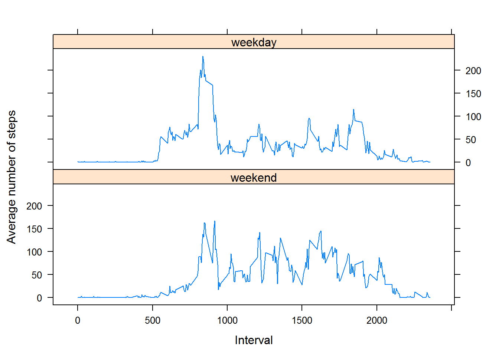

Load useful libraries:

```r
library(sqldf)
library(lattice)
```

## Loading and preprocessing the data

Load the data:

```r
data <- read.csv(file = "./activity.csv")
```

Convert "date" column to Date type:

```r
data[,2] <- as.Date(data[,2])
```

## What is mean total number of steps taken per day?

Ignoring the missing values in the dataset:

```r
meaningfuldata <- data[is.na(data$steps)==FALSE,]
```

1. Calculate the total number of steps taken per day:

```r
totals <- aggregate(meaningfuldata$steps, list(meaningfuldata$date), sum)
```

Barplot (shows distribution of total number of values by days):

```r
barplot(totals$x, names.arg=(totals$Group.1), ylab = "Total number of steps")
```

 

2. Histogram (shows frequency of occurences of numbers of total values):

```r
hist(totals$x, breaks = 10, xlab = "Total number of steps", main=NULL)
```

 


3. For the total number of steps taken per day mean is `mean(totals$x)=`10766.1887 and median is `median(totals$x)=`10765.

## What is the average daily activity pattern?
1. Time series plot (i.e. type = "l") of the 5-minute interval (x-axis) and the average number of steps taken, averaged across all days (y-axis):

```r
avg_steps <- aggregate(meaningfuldata$steps, list(meaningfuldata$interval), mean)
plot(avg_steps$Group.1, avg_steps$x, type="l", xlab = "Interval", ylab = "Average number of steps")
```

 

2. Which 5-minute interval, on average across all the days in the dataset, contains the maximum number of steps?

```r
avg_steps[which.max(avg_steps$x),1]
```

```
## [1] 835
```

## Imputing missing values
1. Calculate and report the total number of missing values in the dataset (i.e. the total number of rows with NAs)

```r
sum(!complete.cases(data))
```

```
## [1] 2304
```

2. Devise a strategy for filling in all of the missing values in the dataset. The strategy does not need to be sophisticated. For example, you could use the mean/median for that day, or the mean for that 5-minute interval, etc.

```
Let's populate with mean values for 5-minute interval with rounding to integer.
```

3. Create a new dataset that is equal to the original dataset but with the missing data filled in.

```r
inputed_data <- sqldf('
    select 
        coalesce(a.steps, b.x) as steps,
        a.date,
        a.interval
    from data a
    left join avg_steps b
        on a.interval = b.[Group.1]
        and a.steps is null')
```

Check there is no NA anymore:

```r
sum(!complete.cases(inputed_data))
```

```
## [1] 0
```

4. Make a histogram of the total number of steps taken each day and Calculate and report the mean and median total number of steps taken per day. Do these values differ from the estimates from the first part of the assignment? What is the impact of imputing missing data on the estimates of the total daily number of steps?

```r
inputed_totals <- aggregate(inputed_data$steps, list(inputed_data$date), sum)
hist(inputed_totals$x, breaks = 10, xlab = "Total number of steps", main=NULL)
```

 

For the total number of steps taken per day with populated NA values mean is `mean(inputed_totals$x)=`10749.7705 and median is `median(inputed_totals$x)=`10641.
Values are slighlty less and there is no significant difference for the histograms.

## Are there differences in activity patterns between weekdays and weekends?

1. Create a new factor variable in the dataset with two levels – “weekday” and “weekend” indicating whether a given date is a weekday or weekend day.

```r
inputed_data[,2] <- as.Date(inputed_data[,2])

weekends <- c('суббота', 'воскресенье') # my 'weekdays' function returns result in russian - don't know how to change it
# use weekends <- c('sunday', 'saturday') if it doesn't work for you

inputed_data$weekday <- factor((weekdays(inputed_data$date) %in% weekends), 
         levels=c(TRUE, FALSE), labels=c('weekend', 'weekday'))
```

2. Make a panel plot containing a time series plot (i.e. type = "l") of the 5-minute interval (x-axis) and the average number of steps taken, averaged across all weekday days or weekend days (y-axis). See the README file in the GitHub repository to see an example of what this plot should look like using simulated data.

```r
inputed_avg_steps <- aggregate(inputed_data$steps, list(inputed_data$interval, inputed_data$weekday), mean)

xyplot(x ~ Group.1| Group.2, data = inputed_avg_steps, type = "l", layout=c(1,2), xlab = "Interval", ylab = "Average number of steps")
```

 
